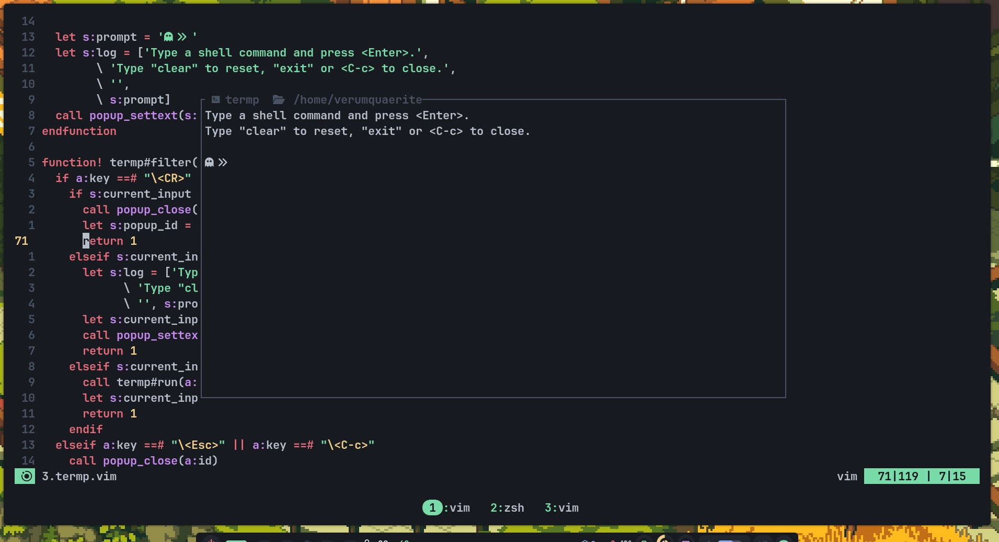

# termp.vim
A vim plugin to summon a floating terminal utilizing vim popups.

<p align="center">
  <a href="https://github.com/V1337Q/termp.vim/stargazers">
    
  </a>
  <a href="https://github.com/V1337Q/termp.vim/issues">
    
  </a>
</p>

## Preview



*I pushed this commit using this plugin, btw.

## Installation

### With vim-plug:
```vim
Plug 'V1337Q/termp.vim'
```
theres that

